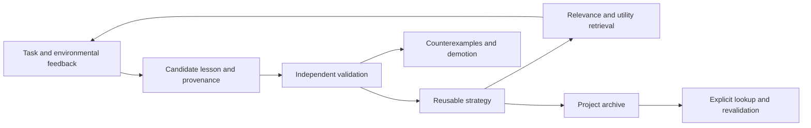

# SEA — Self-Evolving Agent

An evidence-driven experience kernel for agents that learn reusable strategies from interaction, without creating a new skill for every task.

**Status: research design and runnable memory-lifecycle prototype. No demonstrated autonomous learning gains yet. No LLM adapter, automatic evaluator, or background scheduler is included.**

## Why SEA?

Foundation models already have general knowledge and can solve unfamiliar tasks. What is often missing after deployment is a persistent learning loop: capture experience, test a proposed lesson, retain useful changes, and retrieve them when they matter.

We define useful self-evolution operationally: persistent changes derived from earlier interactions improve quality or reduce cost on unseen future tasks while retaining previous capabilities. This may happen in external memory or agent programs without updating model weights. It does not imply consciousness or unbounded improvement.

Read the [research notes](docs/research.md), [evaluation protocol](docs/evaluation.md), and [core skill](skills/experience-core/SKILL.md).

The [related-work comparison](docs/related-work.md) maps nine GitHub systems to concrete adoption decisions. The [algorithm reference](docs/algorithms.md) documents paired utility, uncertainty bounds, Pareto preservation, and UCB1 experiment allocation, including assumptions and limitations.

## Quick start

Python 3.10 or later. The runtime uses only the standard library and makes no network requests or paid API calls.

```bash
python demo.py
python evolution_demo.py
python -m unittest discover -s tests -v
python kernel.py --help
```

The demo uses **synthetic rewards** to illustrate state transitions. It is not a learning benchmark.

```bash
python kernel.py add --project demo --trigger "CSV encoding" --lesson "Inspect encoding before parsing CSV" --evidence "fixture:encoding" --origin discovery-1
# Replace ID with the returned memory ID. Each task must be an independent validation case.
python kernel.py feedback --id ID --task holdout-1 --reward 1 --evidence "test:holdout-1:passed"
python kernel.py recall "CSV encoding" --project demo --budget 2048
python kernel.py archive demo
python kernel.py recall "CSV encoding" --project demo --include-archived
```

The default database is `memory.sqlite3` in the working directory and is excluded from Git. Promotion requires at least three distinct validation task IDs, every reward at least 0.5, and a smoothed mean at least 0.7. Counterexamples can demote a lesson. These are prototype heuristics, not statistical significance criteria. Evidence strings and task independence must be verified by the caller.

## Architecture



| Component | Implemented | Future work |
|---|---|---|
| Core skill | Experience-management protocol | Automatic host integration |
| Persistent memory | SQLite, provenance, project scope, events | Contradiction links, temporal validity, original evidence storage |
| Validation gate | Task ID deduplication, discovery-task exclusion, demotion | Trusted evaluators, statistical tests, causal attribution |
| Context selection | Lexical relevance, utility ranking, whole-record budget | Semantic retrieval, model tokenizer, task-state compiler |
| Lifecycle | Project archive and explicit lookup | Automatic distillation, reactivation workflow, skill generation |
| Exploration | Budgeted experiment guidance in the skill | Scheduler, real environment experiments, isolated execution |
| Candidate selection | Offline paired comparison, retention bounds, Pareto frontier, UCB1 allocation | Trusted execution reports, persistent program archive, automatic successor handover |

The budget limits **UTF-8 bytes of returned text**, not model tokens or the surrounding prompt. Records that do not fit are skipped intact. Retrieval scans project records and therefore grows in cost with memory size. English word and CJK character matching is a dependency-free baseline, not semantic retrieval.

## Agent integration

The host calls `recall` before a task, checks applicability and evidence, records candidates after meaningful outcomes, and submits `feedback` from external tests. Loading the skill alone does not schedule these actions. Candidates are excluded from normal retrieval; an experiment controller can inspect them through `Kernel.get(id)`.

The skill is provided inside this repository. It has not been installed globally or used to change existing agent settings. The kernel does not execute stored code or enforce system permissions; the host remains responsible for file, network, and tool boundaries.

## Research direction

**Design principle: every component is a potential subject of evolution.** This includes the task agent, memory kernel, core skill, runner, scheduler, learning procedure, and evaluation methodology. The runner is an initial implementation, not a permanently privileged layer outside the learning loop. Evolvability does not grant permission to change host settings or bypass user constraints. Changes to evaluation must be validated against independent evidence; changing a score definition is not evidence of improved capability. See [recursive evolution](docs/research.md#7-recursive-evolution-without-a-permanently-fixed-runner).

Our proposed combination is to allocate memory by future decision value, promote lessons using counterfactual benefit, and support compression with recoverable evidence. Each component has precedents; SEA does not claim to invent self-evolution, hierarchical memory, or skill archival.

The first milestone is reliable experience accumulation. Claims of improved capability require uncontaminated future-task evaluation. See the evaluation protocol for baselines, ablations, and falsification criteria.

## License

MIT. See [LICENSE](LICENSE).
