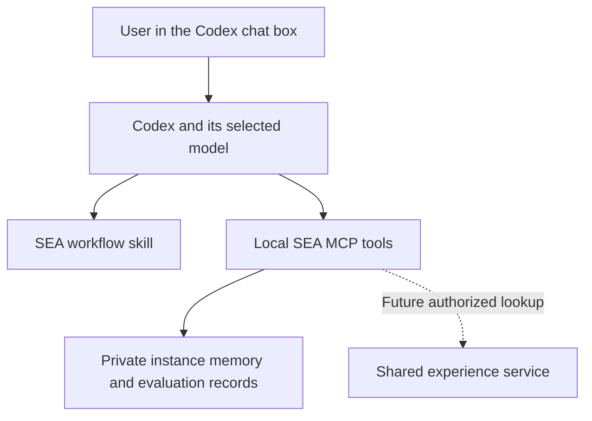

# Using SEA through the Codex chat interface

Recorded: 2026-09-06. Preferred user experience: ordinary conversation in the desktop chat box. Terminal commands are implementation details for the host, not the required daily interaction model.

## What can work today

The current repository can be used by a Codex task that has access to its files and a Python runtime. Ask Codex to read `skills/experience-core/SKILL.md`, use a project-scoped local database, retrieve relevant experience, and record externally supported lessons while completing your task. Codex can invoke the existing Python tools on your behalf; you need not type those commands yourself.

Example request when working in the SEA repository:

> Use the experience-core protocol in this repository for this task. Keep memory local, retrieve only relevant lessons, and record candidates from actual outcomes. Help me solve the following problem: ...

This is host-assisted use of the current prototype. It is not an installed plugin, guaranteed automatic invocation, a shared service, or an always-running autonomous learner. The repository's `skills/` directory alone should not be assumed to install a skill into every Codex task. An explicit file reference is sufficient for a task that can read that file; normal discovery needs an appropriate supported installation or packaging step.

Candidate lessons require validation; ordinary task success does not automatically prove transfer. Fresh sessions can read the same persisted database when explicitly connected to the same instance and project scope. A skill does not by itself guarantee lifecycle hooks on every message or complete access to all past conversations.

## Recommended integration: skill plus local MCP tools

Keep the Codex conversation and its selected model as the interaction and reasoning layer. Package SEA's workflow guidance as a skill, and expose memory operations through a local MCP server. The host invokes tools while presenting normal conversational results. A local memory-only MCP server need not make a separate model API request; additional model-based evaluators or autonomous workers would be separate integrations with their own usage and authorization.

Proposed tool surface: `recall`, `record_candidate`, `record_feedback`, `compare_candidates`, `archive_project`, and `inspect_learning`. Later add separately authorized shared search, package inspection, publication, and outcome contribution. These are proposed wrappers; there is currently no SEA MCP server in this repository. Administrative sharing operations should remain distinct from local memory operations.

Codex skill guidance supports explicit or implicit selection and progressive loading of skill content. MCP supports connections to external tools; official documentation describes desktop settings for adding servers and local STDIO or HTTP transports. Exact labels can vary with client version. Sources: [Build skills](https://learn.chatgpt.com/docs/build-skills) and [Model Context Protocol](https://learn.chatgpt.com/docs/extend/mcp?surface=cli).

## Conversation-first behavior

After integration, requests should sound like:

- "Help me fix this problem and retain any validated reusable lesson."
- "What has my SEA learned from this project?"
- "Find relevant community experience, but keep my project data private."
- "Show the evidence before adopting this proposed improvement."
- "Archive this project's experience."

Report what changed, why, and the evidence. Distinguish candidates from validated experience. Do not make the user manually invoke database operations, interpret raw JSON, or manage a terminal to complete routine tasks. Built-in tool activity and permission prompts remain under the host's control; SEA cannot promise to hide or bypass them.

## Phased implementation

1. Host-assisted local use: the existing skill and scripts operate within an explicitly scoped Codex task.
2. Local MCP integration: implement typed tools, persistent instance identity and stable memory paths, then test tool calls and fresh-session recall through the chat interface.
3. Distribution: package the skill and tested server into an installable extension/plugin using supported mechanisms. Installation and connection are separate from merely cloning the repository.
4. Shared learning: introduce authenticated progressive lookup and opt-in experience contribution using the [shared-learning design](shared-learning.md).
5. Real growth loop: connect actual tasks and independent evaluators, version candidate core/runner changes, and test successor handover. Background learning requires an explicitly configured runner or supported scheduling mechanism; a skill file does not keep a task alive.

An independent SEA chat application is a later option if model-provider flexibility outside Codex or a dedicated interface is needed. It is unnecessary for the first usable version. SEA can revise its own implementation within permissions; it cannot rewrite the proprietary host, replace the host's model weights, or change approval settings merely by installing a skill.
