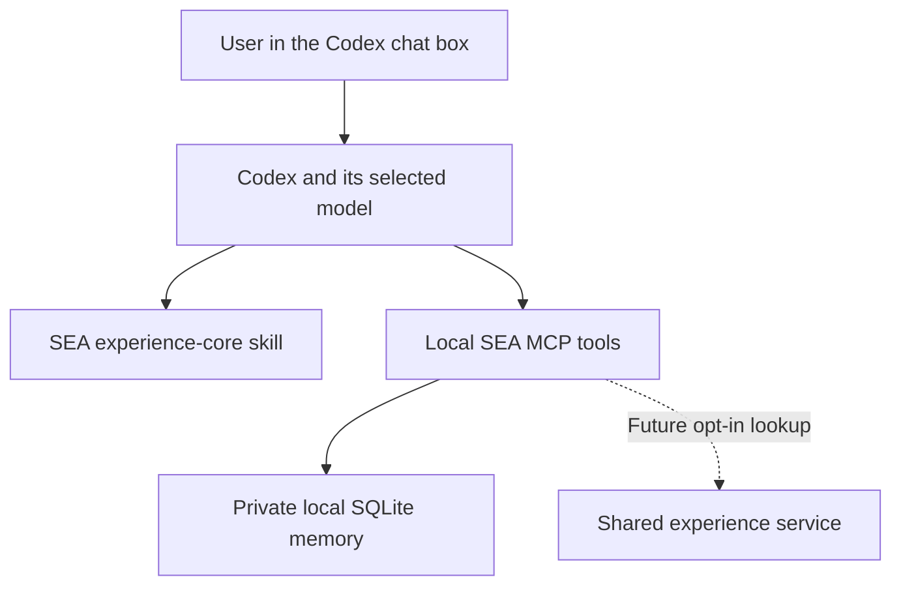

# Using SEA through the Codex chat interface

Updated: 2026-09-06. SEA now provides a local MCP STDIO server and a Codex plugin configuration script. Daily interaction stays in the chat box; the host handles Python and tool calls.

## Use it in chat

After installation, start a new Codex task so it loads the plugin's skills and tools. Say:

> Use SEA for this task. Retrieve relevant experience, complete the authorized work, and retain lessons supported by actual outcomes. Help me with ...

Other requests include "What has SEA learned from this project?", "Remember this preference", and "Archive this project's experience". The host can select the skill implicitly, but installation does not guarantee invocation on every message. If the tools are missing, report the connection problem; do not claim a memory write occurred.

The Codex model does the reasoning. This local SEA server makes no separate model API calls. Retrieved memory is supplied to the host model, so the host's model/data settings still apply. SEA has no telemetry, shared search, or contribution client.

## Implemented tools

| Tool | Behavior |
|---|---|
| `get_preferences` / `record_preference` | Read or update explicitly stated preferences with source attribution; no invented rewards |
| `recall` | Relevant active lessons, with explicit archived lookup and a UTF-8 byte budget |
| `record_candidate` | Persist a provisional lesson with discovery source |
| `record_feedback` | Apply observed independent results through the existing heuristic promotion/demotion gate |
| `inspect_learning` / `get_memory` | Page through short metadata, then inspect one full record on demand |
| `archive_project` | Archive named-project lessons; preferences remain separate |
| `compare_candidates` | Evaluate an external paired report; does not execute or install a successor |

The database path defaults to `~/.sea/memory.sqlite3`, independent of the task's working directory. The plugin config pins an absolute database path. Use a stable project identifier, such as its canonical repository URL. Project scope is an organizational filter, not a multi-user authentication boundary: a connected host can select any project in its instance. Use separate databases/processes for separate owners.

Preference records are user statements, not measured capability gains. Current instructions override memory; project preferences override global defaults. Updating the same project/key replaces the current value and appends an audit event. There is no preference erasure API yet. Normal lesson recall excludes candidates. Evidence authenticity and task independence remain caller responsibilities.

Recall and preference budgets cover exact returned UTF-8 text, not MCP envelopes or model tokens. Whole records that do not fit are skipped. Metadata inspection is paginated. Retrieval is lexical and still scans scoped records; this prototype has not demonstrated million-instance scale.

## Local installation for a Codex host

The user can ask Codex to perform these steps; no terminal interaction is required from them. Python 3.10+ is required; the MCP dependency is pinned in `requirements-mcp.txt`. The memory and comparison CLIs remain standard-library-only.

1. Create a dedicated Python environment and install `requirements-mcp.txt`.
2. Using Codex's `plugin-creator` skill, scaffold `sea` with skills, MCP, and the personal marketplace. Its default source is `~/plugins/sea`; do not overwrite an unrelated existing plugin.
3. Run `scripts/configure_local_plugin.py` with that MCP-enabled Python interpreter. It populates the scaffold with a runtime snapshot and the self-contained skill. Optional `--plugin` and `--db` arguments select explicit local paths. This script does not edit marketplace or host settings.
4. Validate the plugin and skill using the Codex skill validators, then install `sea@personal` with the Codex plugin CLI. Confirm it is installed and enabled.
5. Start a new task for plugin discovery. Verify tool discovery and a local preference write/read before relying on memory.

The generated `.mcp.json` contains absolute machine-local interpreter, runtime, and database paths. Keep that development installation on its machine; other users must regenerate it. The repository contains no personal database or generated machine configuration. The configured Python environment and plugin source directory must remain available. This is a reproducible local integration, not a portable one-click marketplace release.

For updates, validate the marketplace identity, rerun the configuration script, use the plugin-creator cachebuster helper, and reinstall using the supported update workflow. Start a new task afterward. The runtime is a snapshot; editing the repository alone does not update an installed plugin.

Official host references: [Build skills](https://learn.chatgpt.com/docs/build-skills), [MCP configuration](https://learn.chatgpt.com/docs/extend/mcp?surface=cli), and the installed Codex `plugin-creator` skill. Server implementation uses the [official MCP Python SDK v1](https://github.com/modelcontextprotocol/python-sdk/tree/v1.x).

## Verification and remaining work

The suite includes real MCP initialization, tool discovery, schema rejection, candidate promotion and archival, scope checks, paginated inspection, report comparison, and fresh-process preference/lesson recall. Tests use temporary databases and explicitly synthetic evidence. These validate plumbing, not human-like learning or measured transfer.

During local installation on 2026-09-06, Codex reported SEA installed and enabled. An SDK client launched the installed configuration, discovered all nine tools, stored two user-stated preferences, and retrieved them through a new server process. New-task desktop invocation remains a separate host pickup step; it was not tested by creating a user task automatically.

Future milestones are authenticated shared lookup and opt-in contribution, then actual task/evaluator integration and recoverable successor handover. See [shared learning](shared-learning.md). A skill does not keep a task alive or schedule background experiments. Every SEA implementation component remains revisable within the user's authorization; the integration cannot rewrite the host's proprietary internals or its model weights.
