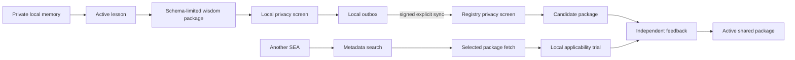

# SEA Community Registry

The registry makes cross-instance learning concrete without centralizing private memory. A SEA client distills one locally active lesson into a fixed `sea-wisdom/1.0` package, runs deterministic privacy checks, queues it locally, and sends it only through an explicit sync call. Search returns metadata first; the full method is fetched separately when relevant.

## Data path



The package contains a generalized problem, conditions, method, counterexamples, aggregate reward counts, compatibility, lineage, producer revision, and policy version. It excludes raw conversations, files, code, credentials, identifiers, local preferences, project names, paths, and traces. Both client and registry enforce exact fields and common sensitive-data patterns. This is a conservative screen, not a guarantee of anonymization.

## Authentication and promotion

Every non-public request includes a client ID, Unix timestamp, random nonce, service-policy version, body digest, and HMAC-SHA256 signature. The registry derives a different secret for each client from a server-only seed, rejects expired or replayed requests, and separates read access from contribution access. Content-addressed package IDs make publication idempotent.

New packages start as candidates. The initial registry rule activates a package after at least three distinct client/task feedback records, all with reward at least 0.5. Search ranking uses feedback count, mean reward, and recency. These rules are versioned bootstrap components. Successors require independent evaluation, retained predecessors, and controlled deployment; downloaded code is never activated automatically.

## Cloudflare deployment

The production reference uses a Cloudflare Worker and D1. Runtime types are generated from `wrangler.jsonc`; secrets are created with Wrangler and never committed.

The repository owner's reference deployment is `https://sea-community-registry.li-siye-0123.workers.dev`. The public `/health` and `/v1/policy` endpoints expose runtime status and the exact current sharing contract. All package, search, feedback, lineage, and component operations require an enrolled signed client.

```bash
npm ci
npm run cf:types
npm run cf:check
npm run cf:test
npx wrangler d1 create sea-community
# Put the returned database_id in wrangler.jsonc.
npx wrangler secret put ADMIN_TOKEN
npx wrangler secret put CLIENT_KEY_SEED
npx wrangler d1 migrations apply sea-community --remote
npx wrangler deploy
```

Enroll one client with `POST /v1/admin/enroll`, an administrator bearer token, and this JSON body:

```json
{"client_id":"opaque-instance-id","policy_version":"2026-09-07.1","can_contribute":true}
```

Store the returned client secret in a private environment variable. Configure the local server without embedding it:

```bash
python scripts/configure_local_plugin.py \
  --registry-url https://your-worker.workers.dev \
  --client-id opaque-instance-id \
  --client-secret-env SEA_REGISTRY_SECRET
```

The Python `registry.py` server is a local reference and test fixture. Its SQLite client-secret storage is unsuitable for a public deployment; the Worker derives secrets instead.

## Evolvability boundary

`community-sync-policy` is a versioned local component whose bounded batch size and retry limit can be replaced only after SEA's paired comparison gate marks the named successor eligible. Registry code, privacy rules, ranking, package schemas, and evaluators are also evolvable components, but each needs its own tests, evaluation contract, deployment, and rollback path. Evolution changes the implementation through evidence; it does not weaken authorization or privacy constraints.
