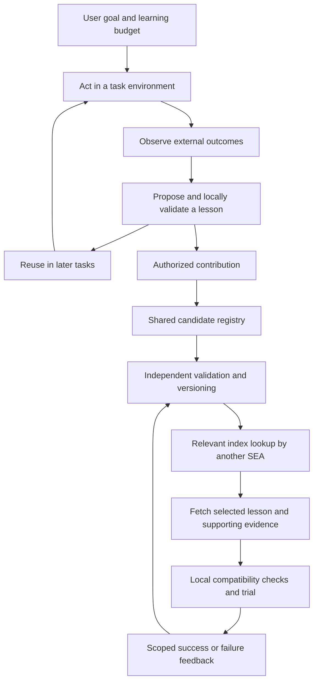

# Shared learning and individual growth

Recorded: 2026-09-06. This document captures the intended architecture. Shared services, automatic contribution, model adapters, autonomous task execution, and successor handover are not implemented yet.

## Product principles

SEA instances should develop different specializations from their owners' goals and experience, while learning selectively from one another. There is no universally best instance: usefulness depends on the task, environment, resources, and evidence. Improvement is a hypothesis to validate, not a guarantee that every update is beneficial.

Every implementation component may evolve, including the core skill, memory, runner, scheduler, evaluator, and mechanisms that propose modifications. Each comparison still needs independent evidence and an explicit evaluation contract. User permissions and goals are not silently rewritten by that process.

The lifecycle metaphor is embryo, learner, apprentice, specialist, and mentor. These are product stages defined by demonstrated behavior, not human intelligence ages. An instance can be advanced in one domain and inexperienced in another. The current prototype is at the embryo stage: some supporting mechanisms exist, but a real autonomous learning cycle has not been demonstrated.

## Two linked loops

Individual learning starts with uncertainty detection, testable questions, bounded experimentation, trustworthy feedback, conditional memory, and cost awareness. Domain expertise then grows through actual tasks. Shared lessons should accelerate this process without replacing local validation.

## Share experience packages, not complete private histories

Proposed package fields: immutable ID, revision, parent package IDs, problem description, applicability conditions, prerequisites, method or patch, evidence references, evaluation outcomes, cost, counterexamples, tested model/tool/environment versions, visibility, contributor identity, and license.

Packages can branch rather than overwrite each other. Another SEA may narrow applicability, add a counterexample, or develop a cheaper alternative. Record lineage and preserve alternatives. Repeated endorsements from one source are not independent evidence. Popularity is not a substitute for task-specific validation.

## Progressive disclosure

1. Consult relevant local memory first.
2. If a capability gap remains, query the authorized shared index. Return only a small set of relevant metadata records, not the entire catalog.
3. Fetch a selected lesson only when its applicability warrants inspection.
4. Fetch evidence, examples, or executable artifacts only when needed for verification or use.
5. Revalidate in the local environment, cache useful material, and contribute outcomes only within the owner's sharing policy.

Proposed scopes are private, team, and community. These are access boundaries, not merely retrieval ranking tags. A shared logical network need not use one physical database. Keep index, content, and evidence budgets distinct; caching and selective retrieval improve latency but cannot guarantee instantaneous access.

## Minimal shared service

Proposed operations are `publish`, `search`, `get`, `feedback`, and `versions`. Authentication and scope filtering happen before content is returned. A new publication is a candidate, not an approved lesson. Preserve provenance, compatibility information, independent results, and counterexamples when recommending it.

Use a database for metadata, access control, and evaluation records; object storage for large experience packages and artifacts; and local storage for private state and caches. GitHub hosts source code, protocols, reviewed changes, and selected release artifacts. It is not the intended high-volume user-state database. GitHub's [repository limits](https://docs.github.com/en/repositories/creating-and-managing-repositories/repository-limits) recommend keeping generated data outside Git and constrain repository structure and activity.

Millions of instances need not each duplicate the base code or model weights. Store shared versions once and individual configuration, memory, and code deltas separately. Large-scale storage and large-scale concurrent inference are different capacity problems; neither has been validated by this prototype.

## Contribution and privacy

Offer local-only, community-read, and community-contribute modes. Contributions require explicit authorization of their scope. A user may authorize a bounded automatic contribution policy rather than approve every package separately. Private conversations, files, credentials, and raw trajectories are not automatically included. Start with synthetic examples and reproducible methods; sensitive-data detection is imperfect and must not be advertised as guaranteed anonymization.

Shared searches can reveal task intent, so minimize query contents as well as uploads. Cloud model requests and SEA registry requests are separate data flows. Permission to use one does not authorize the other. Local use alone does not send data to SEA maintainers; current code has no telemetry or upload client.

A future registry should support withdrawal and version status. Withdrawal can prevent future distribution through the service, but cannot guarantee erasure of copies already publicly downloaded. Signed provenance identifies a contributor or artifact; it does not prove correctness. Execute retrieved code only through the host's normal isolation and permission mechanisms.

## Model independence

An instance may use its owner's cloud API, an organizational endpoint, or a local model. A common model can support differently specialized instances. Preserve experience independently of the model connection, record compatibility, and revalidate important capabilities after a model change. The model adapter should expose generation, tool use, errors, and cost/usage information. SEA currently has no such adapter.

## First end-to-end milestone

Use two separate instances and an independently evaluated task family. A discovers and validates a method; its owner authorizes a package; B encounters a new related task and selectively retrieves the package. Compare B with and without the package under equal total budgets. B contributes an observed counterexample; A can discover the revised applicability. Include process restart, scope isolation, and stale-version tests. This establishes an initial knowledge-transfer experiment, not population-wide or monotonic improvement.
